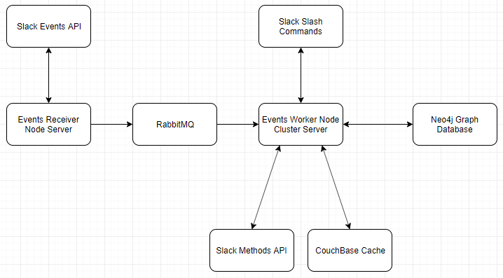

# RBC-Innovation-Challenge

How to run the code
- To run all of the services is complicated, here is a brief overview we can go into more detail in person
1) Download rabbitMQ and make sure it is running as a service on your machine
2) Download couchbase and configure it:
    - create an account in the web UI
    - add the password and username into your .env file
    - create a bucket called Channel_Members
3) Start Events-Receiver Server
    - npm install
    - npm start
    - open ngrok and create connection to the port which this server is on (8080)
        - ngrok http 8080
    - open https://api.slack.com/apps and update the URL for event subcription for your app
4) Start Events-Worker Server
    - create .env file and add
         - SLACK_CLIENT_ID
         - SLACK_CLIENT_SECRET_ID
         - SlACK_ACCESS_TOKEN
            - this is the hard one to get, you will need to use the generate slack token code
            - I will write up and explanation/walk you through it
    - npm install
    - npm start
        - if your compute only has 1 core adjust index.js numOfCores to only use 1
        - You will still technically have processes sharing cores with other server but this is more of a POC then prod level product
5) Test by sending a message in your slack workspace. This system is not made to be connected to RBC workspace currently. Instead make your own slack workspace (I can also add you to the testing one I have message me)

To run code just for adding slash commands
  - you only need to start Events-Worker Server
  1) go to index.js in events-worker and comment out:
    require('./CouchBaseCache/setUp');
    require('./RabbitConsumer/RabbitConsumer');
  This will disable the cache and the rabbit
  2) create .env file and add
      - SLACK_CLIENT_ID
      - SLACK_CLIENT_SECRET_ID
      - SlACK_ACCESS_TOKEN
          - this is the hard one to get, you will need to use the generate slack token code
          - I will write up and explanation/walk you through it
  3) npm install
  4) npm start
      - note you may first want to change numCPU to 1 just to make life easier for debugging
  5) code away
      - put your route into Routes folder (refer to events-reciever db for example)
      - get user ID from email is already created for you
